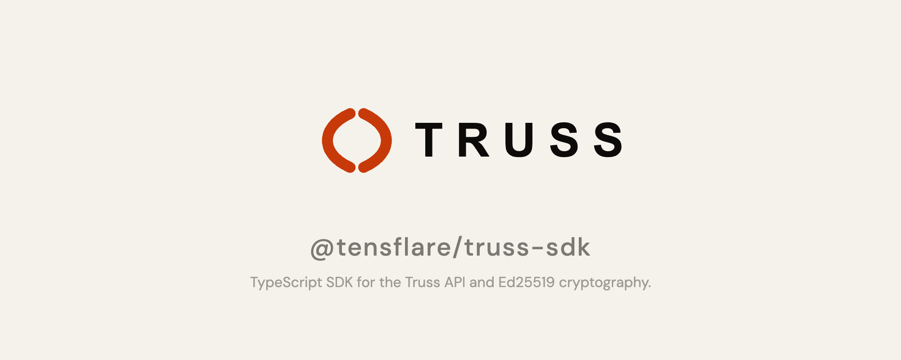

# @tensflare/truss-sdk

**TypeScript SDK for the Truss trust infrastructure API — create mandates, record actions, manage agents, and verify evidence.**

[](https://www.npmjs.com/package/@tensflare/truss-sdk)
[](LICENSE)
[](https://github.com/tensflare/truss-sdk-js/actions)

---

## What is Truss?

Truss is an **accountability layer for AI agents** — it records every agent action as a cryptographically signed, tamper-evident audit trail. [Learn more →](https://truss.tensflare.com/docs)

## Features

- **Ed25519 cryptography** — Key generation, payload signing, and signature verification via `libsodium-wrappers`
- **`TrussClient`** — Full-featured HTTP client for the Truss API (mandates, actions, agents, delegations, evidence, alerts, and more)
- **`ActionContext`** — Builder pattern for recording actions with proper chain-of-custody linkage
- **TypeScript-first** — Full type coverage derived from TAP schemas

## Installation

```bash
npm install @tensflare/truss-sdk
```

## Quick start

```typescript
import {
  generateKeypair,
  signPayload,
  verifySignature,
  TrussClient,
} from "@tensflare/truss-sdk";

// 1. Generate an Ed25519 keypair
const kp = generateKeypair();
console.log("Public key:", kp.publicKey);
console.log("Private key:", kp.privateKey); // keep secret!

// 2. Sign and verify
const sig = signPayload({ action: "read", value: 42 }, kp.privateKey);
const valid = verifySignature({ action: "read", value: 42 }, sig, kp.publicKey);
console.log("Signature valid:", valid); // true

// 3. Create an API client
const client = new TrussClient({ apiKey: "tr_your_api_key" });

// 4. Register an agent
const agent = await client.createAgent({
  name: "My Agent",
  public_key: kp.publicKey,
  description: "My autonomous agent",
});

// 5. Create a mandate
const mandate = await client.createMandate({
  agent_id: agent.id,
  agent_name: agent.name,
  scope: { permitted_actions: ["read", "write"] },
  validity: {
    issued_at: new Date().toISOString(),
    expires_at: new Date(Date.now() + 86400000).toISOString(),
  },
  private_key: kp.privateKey,
});

// 6. Record an action
const ctx = client.action("read", mandate.id, kp.privateKey);
ctx.recordInput({ file: "/data/report.pdf" });
ctx.recordOutput({ summary: "Report contains 42 records" });
const result = await ctx.commit(agent.id, 1, null);
console.log("Action recorded:", result.id);
```

## API reference

### `generateKeypair()`

Returns `{ publicKey: string, privateKey: string }` — Ed25519 keypair via libsodium-wrappers.

### `signPayload(payload, privateKey)`

Signs any JSON-serialisable payload and returns a hex-encoded Ed25519 signature.

### `verifySignature(payload, signature, publicKey)`

Verifies an Ed25519 signature. Returns `boolean`.

### `new TrussClient(options)`

| Option | Type | Description |
|---|---|---|
| `apiKey` | `string` | Truss API key (`tr_` prefix) |
| `apiUrl` | `string` | API base URL (default `http://localhost:4000`) |

**Client methods:** `createAgent`, `getAgent`, `listAgents`, `createMandate`, `getMandate`, `listMandates`, `recordAction`, `getAction`, `listActions`, `createDelegation`, `generateEvidence`, `verifyEvidence`, and more.

### `client.action(actionType, mandateId, privateKey)`

Returns an `ActionContext` builder with `.recordInput()`, `.recordOutput()`, and `.commit()`.

## Related packages

| Package | Description |
|---|---|
| [@tensflare/tap](https://github.com/tensflare/truss-tap) | Core Zod schemas for mandates, actions, and delegations |
| [@tensflare/cli](https://github.com/tensflare/truss-cli) | Command-line interface for the Truss API |
| [truss-sdk (Python)](https://github.com/tensflare/truss-sdk-python) | Python SDK equivalent |

## Development

```bash
npm install
npm run build
npm test
```

## Contributing

Pull requests are welcome. Please see the [contribution guidelines](https://truss.tensflare.com/docs/contributing).

## License

Apache 2.0 — see [LICENSE](LICENSE).
